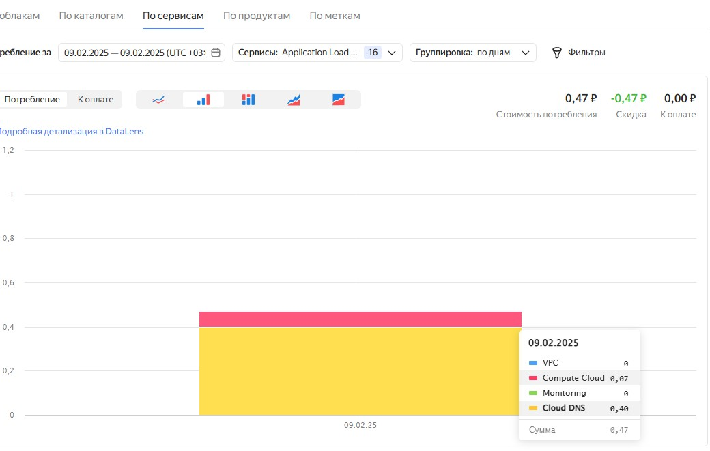

# Домашнее задание к занятию 1.  «Введение в виртуализацию» Помельников Станислав
   
## Задача 1

1. Создайте через web-интерфейс Yandex Cloud - VPC и виртуальную машину из инструкции конфигурации "эконом-ВМ" с публичным ip-адресом. В пункте "Выбор образа/загрузочного диска" выберите вкладку "Cloud Marketplace" , щелкните "Посмотреть больше", найдите образ "Yandex Cloud Toolbox".
2. Убедитесь, что вы можете подключиться к консоли ВМ через ssh, используя публичный ip-адрес. Убедитесь, что на ВМ установлен Docker с помощью команды ```docker --version```(команду выполните от имени root пользователя) !
3. Узнайте в инструкции Яндекс, какие еще инструменты предустановлены в данном образе.
4. Оставьте ВМ работать, пока она не выключится самостоятельно! Опция "прерываемая" выключит ее не позже чем через 24 часа. 
5. Для наглядности подождите еще 1 сутки.
6. Перейдите по [ссылке ](https://console.cloud.yandex.ru/billing?section=accounts). Выберите свой платежный аккаунт. Перейдите на вкладку детализация (фильтр "По продуктам") и оцените график потребления финансов.
7. Удалите ВМ или пользуйтесь ею при выполнении последующих домашних заданий курса обучения.

## Решение 1



---

## Задача 2

Выберите один из вариантов платформы в зависимости от задачи. Здесь нет однозначно верного ответа так как все зависит от конкретных условий: финансирование, компетенции специалистов, удобство использования, надежность, требования ИБ и законодательства, фазы луны.

Тип платформы:

- физические сервера;
- паравиртуализация;
- виртуализация уровня ОС;

Задачи:

- высоконагруженная база данных MySql, критичная к отказу - физические сервера - нужна высокая производительность без промежуточных ОС или Гипервизора;
- различные web-приложения - виртуализация уровня ОС - можно запустить несколько приложений на одном физическом сервере, приложения не всегда будут задействованы на 100%;
- Windows-системы для использования бухгалтерским отделом - паравиртуализация;
- системы, выполняющие высокопроизводительные расчёты на GPU - физические сервера.

Объясните критерии выбора платформы в каждом случае.
---

## Задача 3

Выберите подходящую систему управления виртуализацией для предложенного сценария. Опишите ваш выбор.

Сценарии:

1. 100 виртуальных машин на базе Linux и Windows, общие задачи, нет особых требований. Преимущественно Windows based-инфраструктура, требуется реализация программных балансировщиков нагрузки, репликации данных и автоматизированного механизма создания резервных копий.
   - Hyper V т.к. пеймущественно Windows
2. Требуется наиболее производительное бесплатное open source-решение для виртуализации небольшой (20-30 серверов) инфраструктуры на базе Linux и Windows виртуальных машин.
   - KVM - бесплатно, производительно
3. Необходимо бесплатное, максимально совместимое и производительное решение для виртуализации Windows-инфраструктуры.
   - XEN - высокая совместимость
4. Необходимо рабочее окружение для тестирования программного продукта на нескольких дистрибутивах Linux.
   - VMware Workstation
---

## Задача 4

Опишите возможные проблемы и недостатки гетерогенной среды виртуализации (использования нескольких систем управления виртуализацией одновременно) и что необходимо сделать для минимизации этих рисков и проблем. Если бы у вас был выбор, создавали бы вы гетерогенную среду или нет?
- Сложность управления, проблемы безопасности, обучения персонала


### Правила приема

Домашнее задание выполните в файле readme.md в GitHub-репозитории. В личном кабинете отправьте на проверку ссылку на .md-файл в вашем репозитории.
