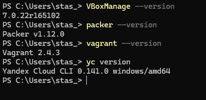
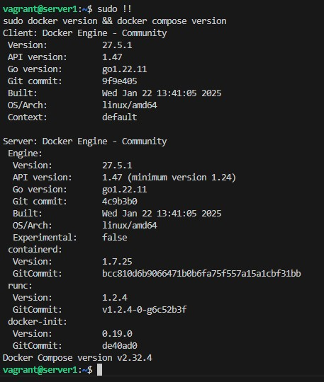

# Домашнее задание к занятию 2. «Применение принципов IaaC в работе с виртуальными машинами» Помельников Станислав

 ## Задача 1
Установите на личный Linux-компьютер или учебную **локальную** ВМ с Linux следующие сервисы(желательно ОС ubuntu 20.04):

- [VirtualBox](https://www.virtualbox.org/),
- [Vagrant](https://github.com/netology-code/devops-materials), рекомендуем версию 2.3.4
- [Packer](https://github.com/netology-code/devops-materials/blob/master/README.md) версии 1.9.х + плагин от Яндекс Облако по [инструкции](https://cloud.yandex.ru/docs/tutorials/infrastructure-management/packer-quickstart)
- [уandex cloud cli](https://cloud.yandex.com/ru/docs/cli/quickstart) Так же инициализируйте профиль с помощью ```yc init``` .

## Решение 1


## Задача 2

1. Убедитесь, что у вас есть ssh ключ в ОС или создайте его с помощью команды ```ssh-keygen -t ed25519```
2. Создайте виртуальную машину Virtualbox с помощью Vagrant и  [Vagrantfile](https://github.com/netology-code/virtd-homeworks/blob/shvirtd-1/05-virt-02-iaac/src/Vagrantfile) в директории src.
3. Зайдите внутрь ВМ и убедитесь, что Docker установлен с помощью команды:
```
docker version && docker compose version
```

3. Если Vagrant выдаёт ошибку (блокировка трафика):
```
URL: ["https://vagrantcloud.com/bento/ubuntu-20.04"]     
Error: The requested URL returned error: 404:
```

Выполните следующие действия:

- Скачайте с [сайта](https://app.vagrantup.com/bento/boxes/ubuntu-20.04) файл-образ "bento/ubuntu-20.04".
- Добавьте его в список образов Vagrant: "vagrant box add bento/ubuntu-20.04 <путь к файлу>".

**Важно:**    
- Если ваша хостовая рабочая станция - это windows ОС, то у вас могут возникнуть проблемы со вложенной виртуализацией. Ознакомиться со cпособами решения можно [по ссылке](https://www.comss.ru/page.php?id=7726).

- Если вы устанавливали hyper-v или docker desktop, то  все равно может возникать ошибка:  
`Stderr: VBoxManage: error: AMD-V VT-X is not available (VERR_SVM_NO_SVM)`   
 Попробуйте в этом случае выполнить в Windows от администратора команду `bcdedit /set hypervisorlaunchtype off` и перезагрузиться.

- Если ваша рабочая станция в меру различных факторов не может запустить вложенную виртуализацию - допускается неполное выполнение(до ошибки запуска ВМ)

## Решение 2


## Задача 3

1. Отредактируйте файл    [mydebian.json.pkr.hcl](https://github.com/netology-code/virtd-homeworks/blob/shvirtd-1/05-virt-02-iaac/src/mydebian.json.pkr.hcl)  или [mydebian.jsonl](https://github.com/netology-code/virtd-homeworks/blob/shvirtd-1/05-virt-02-iaac/src/mydebian.json) в директории src (packer умеет и в json, и в hcl форматы):
   - добавьте в скрипт установку docker. Возьмите скрипт установки для debian из  [документации](https://docs.docker.com/engine/install/debian/)  к docker, 
   - дополнительно установите в данном образе htop и tmux.(не забудьте про ключ автоматического подтверждения установки для apt)
3. Найдите свой образ в web консоли yandex_cloud
4. Необязательное задание(*): найдите в документации yandex cloud как найти свой образ с помощью утилиты командной строки "yc cli".
5. Создайте новую ВМ (минимальные параметры) в облаке, используя данный образ.
6. Подключитесь по ssh и убедитесь в наличии установленного docker.
7. Удалите ВМ и образ.
8. **ВНИМАНИЕ!** Никогда не выкладываете oauth token от облака в git-репозиторий! Утечка секретного токена может привести к финансовым потерям. После выполнения задания обязательно удалите секретные данные из файла mydebian.json и mydebian.json.pkr.hcl. (замените содержимое токена на  "ххххх")
9. В качестве ответа на задание  загрузите результирующий файл в ваш ЛК.
## Решение 3
в ЛК
