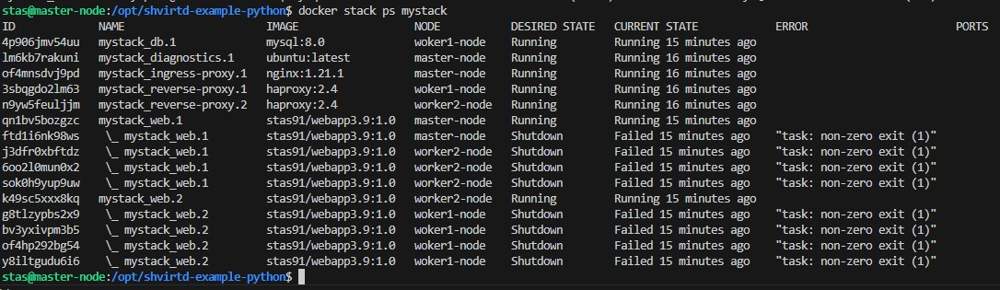

# Домашнее задание к занятию 6. «Оркестрация кластером Docker контейнеров на примере Docker Swarm» Помельников Станислав

---

## Задача 1

Создайте ваш первый Docker Swarm-кластер в Яндекс Облаке.
Документация swarm: https://docs.docker.com/engine/reference/commandline/swarm_init/
1. Создайте 3 облачные виртуальные машины в одной сети.
2. Установите docker на каждую ВМ.
3. Создайте swarm-кластер из 1 мастера и 2-х рабочих нод.

4. Проверьте список нод командой:
```
docker node ls
```
## Решение 1


---

## Задача 2 (*) (необязательное задание *).
1.  Задеплойте ваш python-fork из предыдущего ДЗ(05-virt-04-docker-in-practice) в получившийся кластер.
2. Удалите стенд.

## Решение 2

[docker-compose](img/15-5-2docker-compose.yml)  




---

## Задача 3 (*)

Если вы уже знакомы с terraform и ansible  - повторите практику по примеру лекции "Развертывание стека микросервисов в Docker Swarm кластере". Попробуйте улучшить пайплайн, запустив ansible через terraform синамическим инвентарем.

Проверьте доступность grafana.

Иначе вернитесь к выполнению задания после прохождения модулей "terraform" и "ansible".

## Решение 3


