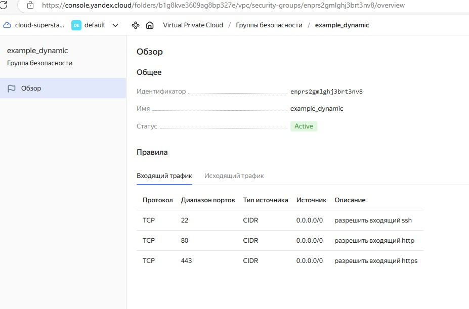

# Домашнее задание к занятию «Продвинутые методы работы с Terraform» Помельников Станислав

### Внимание!! Обязательно предоставляем на проверку получившийся код в виде ссылки на ваш github-репозиторий!

### Задание 1

1. Возьмите из [демонстрации к лекции готовый код](https://github.com/netology-code/ter-homeworks/tree/main/04/demonstration1) для создания с помощью двух вызовов remote-модуля -> двух ВМ, относящихся к разным проектам(marketing и analytics) используйте labels для обозначения принадлежности.  В файле cloud-init.yml необходимо использовать переменную для ssh-ключа вместо хардкода. Передайте ssh-ключ в функцию template_file в блоке vars ={} .
Воспользуйтесь [**примером**](https://grantorchard.com/dynamic-cloudinit-content-with-terraform-file-templates/). Обратите внимание, что ssh-authorized-keys принимает в себя список, а не строку.
3. Добавьте в файл cloud-init.yml установку nginx.
4. Предоставьте скриншот подключения к консоли и вывод команды ```sudo nginx -t```, скриншот консоли ВМ yandex cloud с их метками. Откройте terraform console и предоставьте скриншот содержимого модуля. Пример: > module.marketing_vm

### Решение 1



------


### Задание 2

1. Напишите локальный модуль vpc, который будет создавать 2 ресурса: **одну** сеть и **одну** подсеть в зоне, объявленной при вызове модуля, например: ```ru-central1-a```.
2. Вы должны передать в модуль переменные с названием сети, zone и v4_cidr_blocks.
3. Модуль должен возвращать в root module с помощью output информацию о yandex_vpc_subnet. Пришлите скриншот информации из terraform console о своем модуле. Пример: > module.vpc_dev  
4. Замените ресурсы yandex_vpc_network и yandex_vpc_subnet созданным модулем. Не забудьте передать необходимые параметры сети из модуля vpc в модуль с виртуальной машиной.
5. Сгенерируйте документацию к модулю с помощью terraform-docs.
 
Пример вызова

```
module "vpc_dev" {
  source       = "./vpc"
  env_name     = "develop"
  zone = "ru-central1-a"
  cidr = "10.0.1.0/24"
}
```

### Задание 3
1. Выведите список ресурсов в стейте.
2. Полностью удалите из стейта модуль vpc.
3. Полностью удалите из стейта модуль vm.
4. Импортируйте всё обратно. Проверьте terraform plan. Значимых(!!) изменений быть не должно.
Приложите список выполненных команд и скриншоты процессы.

### Решение 3

<details>
 <summary>Решение, нажмите чтобы показать код</summary>

```
stas@ubuntu-desk:~/cloud-terraform/16_terraform/dz/ter-homeworks/04/src$ terraform state list
data.template_file.cloudinit
module.analytics_vm.data.yandex_compute_image.my_image
module.analytics_vm.yandex_compute_instance.vm[0]
module.marketing_vm.data.yandex_compute_image.my_image
module.marketing_vm.yandex_compute_instance.vm[0]
module.vpc.yandex_vpc_network.network
module.vpc.yandex_vpc_subnet.subnet
stas@ubuntu-desk:~/cloud-terraform/16_terraform/dz/ter-homeworks/04/src$ terraform state rm module.vpc.yandex_vpc_network.network
terraform state rm module.vpc.yandex_vpc_subnet.subnet
Removed module.vpc.yandex_vpc_network.network
Successfully removed 1 resource instance(s).
Removed module.vpc.yandex_vpc_subnet.subnet
Successfully removed 1 resource instance(s).
stas@ubuntu-desk:~/cloud-terraform/16_terraform/dz/ter-homeworks/04/src$ terraform state rm module.analytics_vm.data.yandex_compute_image.my_image
terraform state rm module.analytics_vm.yandex_compute_instance.vm[0]
terraform state rm module.marketing_vm.data.yandex_compute_image.my_image
terraform state rm module.marketing_vm.yandex_compute_instance.vm[0]
Removed module.analytics_vm.data.yandex_compute_image.my_image
Successfully removed 1 resource instance(s).
Removed module.analytics_vm.yandex_compute_instance.vm[0]
Successfully removed 1 resource instance(s).
Removed module.marketing_vm.data.yandex_compute_image.my_image
Successfully removed 1 resource instance(s).
Removed module.marketing_vm.yandex_compute_instance.vm[0]
Successfully removed 1 resource instance(s).
stas@ubuntu-desk:~/cloud-terraform/16_terraform/dz/ter-homeworks/04/src$ terraform state list
data.template_file.cloudinit
stas@ubuntu-desk:~/cloud-terraform/16_terraform/dz/ter-homeworks/04/src$ terraform import module.vpc.yandex_vpc_network.network enp2aot4dol5vsklh202
data.template_file.cloudinit: Reading...
data.template_file.cloudinit: Read complete after 0s [id=398fafd76ee8f170dc4971cf05af7f6e36e830aaee4d53744ae08389a303b30a]
module.vpc.yandex_vpc_network.network: Importing from ID "enp2aot4dol5vsklh202"...
module.analytics_vm.data.yandex_compute_image.my_image: Reading...
module.marketing_vm.data.yandex_compute_image.my_image: Reading...
module.vpc.yandex_vpc_network.network: Import prepared!
  Prepared yandex_vpc_network for import
module.vpc.yandex_vpc_network.network: Refreshing state... [id=enp2aot4dol5vsklh202]
module.analytics_vm.data.yandex_compute_image.my_image: Read complete after 0s [id=fd8h6dko5nd2k10nirmg]
module.marketing_vm.data.yandex_compute_image.my_image: Read complete after 0s [id=fd8h6dko5nd2k10nirmg]

Import successful!

The resources that were imported are shown above. These resources are now in
your Terraform state and will henceforth be managed by Terraform.

stas@ubuntu-desk:~/cloud-terraform/16_terraform/dz/ter-homeworks/04/src$ terraform import module.vpc.yandex_vpc_subnet.subnet e9b373t0ur397stad21p
data.template_file.cloudinit: Reading...
data.template_file.cloudinit: Read complete after 0s [id=398fafd76ee8f170dc4971cf05af7f6e36e830aaee4d53744ae08389a303b30a]
module.marketing_vm.data.yandex_compute_image.my_image: Reading...
module.analytics_vm.data.yandex_compute_image.my_image: Reading...
module.vpc.yandex_vpc_subnet.subnet: Importing from ID "e9b373t0ur397stad21p"...
module.vpc.yandex_vpc_subnet.subnet: Import prepared!
  Prepared yandex_vpc_subnet for import
module.vpc.yandex_vpc_subnet.subnet: Refreshing state... [id=e9b373t0ur397stad21p]
module.analytics_vm.data.yandex_compute_image.my_image: Read complete after 0s [id=fd8h6dko5nd2k10nirmg]
module.marketing_vm.data.yandex_compute_image.my_image: Read complete after 0s [id=fd8h6dko5nd2k10nirmg]

Import successful!

The resources that were imported are shown above. These resources are now in
your Terraform state and will henceforth be managed by Terraform.

stas@ubuntu-desk:~/cloud-terraform/16_terraform/dz/ter-homeworks/04/src$ terraform import module.marketing_vm.yandex_compute_instance.vm[0] fhmiv5rj5f2u7d0asq99
data.template_file.cloudinit: Reading...
data.template_file.cloudinit: Read complete after 0s [id=398fafd76ee8f170dc4971cf05af7f6e36e830aaee4d53744ae08389a303b30a]
module.analytics_vm.data.yandex_compute_image.my_image: Reading...
module.marketing_vm.data.yandex_compute_image.my_image: Reading...
module.marketing_vm.data.yandex_compute_image.my_image: Read complete after 0s [id=fd8h6dko5nd2k10nirmg]
module.marketing_vm.yandex_compute_instance.vm[0]: Importing from ID "fhmiv5rj5f2u7d0asq99"...
module.marketing_vm.yandex_compute_instance.vm[0]: Import prepared!
  Prepared yandex_compute_instance for import
module.marketing_vm.yandex_compute_instance.vm[0]: Refreshing state... [id=fhmiv5rj5f2u7d0asq99]
module.analytics_vm.data.yandex_compute_image.my_image: Read complete after 0s [id=fd8h6dko5nd2k10nirmg]

Import successful!

The resources that were imported are shown above. These resources are now in
your Terraform state and will henceforth be managed by Terraform.

stas@ubuntu-desk:~/cloud-terraform/16_terraform/dz/ter-homeworks/04/src$ terraform import module.analytics_vm.yandex_compute_instance.vm[0] fhmqh4marl5vi6bgora1
data.template_file.cloudinit: Reading...
data.template_file.cloudinit: Read complete after 0s [id=398fafd76ee8f170dc4971cf05af7f6e36e830aaee4d53744ae08389a303b30a]
module.marketing_vm.data.yandex_compute_image.my_image: Reading...
module.analytics_vm.data.yandex_compute_image.my_image: Reading...
module.marketing_vm.data.yandex_compute_image.my_image: Read complete after 0s [id=fd8h6dko5nd2k10nirmg]
module.analytics_vm.data.yandex_compute_image.my_image: Read complete after 0s [id=fd8h6dko5nd2k10nirmg]
module.analytics_vm.yandex_compute_instance.vm[0]: Importing from ID "fhmqh4marl5vi6bgora1"...
module.analytics_vm.yandex_compute_instance.vm[0]: Import prepared!
  Prepared yandex_compute_instance for import
module.analytics_vm.yandex_compute_instance.vm[0]: Refreshing state... [id=fhmqh4marl5vi6bgora1]

Import successful!

The resources that were imported are shown above. These resources are now in
your Terraform state and will henceforth be managed by Terraform.

stas@ubuntu-desk:~/cloud-terraform/16_terraform/dz/ter-homeworks/04/src$ terraform state list
data.template_file.cloudinit
module.analytics_vm.data.yandex_compute_image.my_image
module.analytics_vm.yandex_compute_instance.vm[0]
module.marketing_vm.data.yandex_compute_image.my_image
module.marketing_vm.yandex_compute_instance.vm[0]
module.vpc.yandex_vpc_network.network
module.vpc.yandex_vpc_subnet.subnet
stas@ubuntu-desk:~/cloud-terraform/16_terraform/dz/ter-homeworks/04/src$ terraform plan
data.template_file.cloudinit: Reading...
data.template_file.cloudinit: Read complete after 0s [id=398fafd76ee8f170dc4971cf05af7f6e36e830aaee4d53744ae08389a303b30a]
module.vpc.yandex_vpc_network.network: Refreshing state... [id=enp2aot4dol5vsklh202]
module.analytics_vm.data.yandex_compute_image.my_image: Reading...
module.marketing_vm.data.yandex_compute_image.my_image: Reading...
module.analytics_vm.data.yandex_compute_image.my_image: Read complete after 0s [id=fd8h6dko5nd2k10nirmg]
module.marketing_vm.data.yandex_compute_image.my_image: Read complete after 0s [id=fd8h6dko5nd2k10nirmg]
module.vpc.yandex_vpc_subnet.subnet: Refreshing state... [id=e9b373t0ur397stad21p]
module.analytics_vm.yandex_compute_instance.vm[0]: Refreshing state... [id=fhmqh4marl5vi6bgora1]
module.marketing_vm.yandex_compute_instance.vm[0]: Refreshing state... [id=fhmiv5rj5f2u7d0asq99]

Terraform used the selected providers to generate the following execution plan. Resource actions are indicated with the following symbols:
  ~ update in-place

Terraform will perform the following actions:

  # module.analytics_vm.yandex_compute_instance.vm[0] will be updated in-place
  ~ resource "yandex_compute_instance" "vm" {
      + allow_stopping_for_update = true
        id                        = "fhmqh4marl5vi6bgora1"
        name                      = "stage-web-stage-0"
        # (15 unchanged attributes hidden)

        # (6 unchanged blocks hidden)
    }

  # module.marketing_vm.yandex_compute_instance.vm[0] will be updated in-place
  ~ resource "yandex_compute_instance" "vm" {
      + allow_stopping_for_update = true
        id                        = "fhmiv5rj5f2u7d0asq99"
        name                      = "develop-webs-0"
        # (15 unchanged attributes hidden)

        # (6 unchanged blocks hidden)
    }

Plan: 0 to add, 2 to change, 0 to destroy.

─────────────────────────────────────────────────────────────────────────────────────────────────────────────────────────────────────────────────────────────────────────────────────────────────────────────────────────────────

Note: You didn't use the -out option to save this plan, so Terraform can't guarantee to take exactly these actions if you run "terraform apply" now.
stas@ubuntu-desk:~/cloud-terraform/16_terraform/dz/ter-homeworks/04/src$ 
```

</details>

------

## Дополнительные задания (со звёздочкой*)

### Задание 4*

1. Измените модуль vpc так, чтобы он мог создать подсети во всех зонах доступности, переданных в переменной типа list(object) при вызове модуля.  
  
Пример вызова
```
module "vpc_prod" {
  source       = "./vpc"
  env_name     = "production"
  subnets = [
    { zone = "ru-central1-a", cidr = "10.0.1.0/24" },
    { zone = "ru-central1-b", cidr = "10.0.2.0/24" },
    { zone = "ru-central1-c", cidr = "10.0.3.0/24" },
  ]
}

module "vpc_dev" {
  source       = "./vpc"
  env_name     = "develop"
  subnets = [
    { zone = "ru-central1-a", cidr = "10.0.1.0/24" },
  ]
}
```

Предоставьте код, план выполнения, результат из консоли YC.

### Решение 4

<details>
 <summary>Решение, нажмите чтобы показать код</summary>

```
stas@ubuntu-desk:~/cloud-terraform/16_terraform/dz/ter-homeworks/04/src$ terraform apply
data.template_file.cloudinit: Reading...
data.template_file.cloudinit: Read complete after 0s [id=398fafd76ee8f170dc4971cf05af7f6e36e830aaee4d53744ae08389a303b30a]
module.marketing_vm.data.yandex_compute_image.my_image: Reading...
module.analytics_vm.data.yandex_compute_image.my_image: Reading...
module.marketing_vm.data.yandex_compute_image.my_image: Read complete after 0s [id=fd8h6dko5nd2k10nirmg]
module.analytics_vm.data.yandex_compute_image.my_image: Read complete after 0s [id=fd8h6dko5nd2k10nirmg]

Terraform used the selected providers to generate the following execution plan. Resource actions are indicated with the following symbols:
  + create

Terraform will perform the following actions:

  # module.analytics_vm.yandex_compute_instance.vm[0] will be created
  + resource "yandex_compute_instance" "vm" {
      + allow_stopping_for_update = true
      + created_at                = (known after apply)
      + description               = "TODO: description; {{terraform managed}}"
      + folder_id                 = (known after apply)
      + fqdn                      = (known after apply)
      + gpu_cluster_id            = (known after apply)
      + hardware_generation       = (known after apply)
      + hostname                  = "stage-web-stage-0"
      + id                        = (known after apply)
      + labels                    = {
          + "owner"   = "s.pomelnikov"
          + "project" = "analytics"
        }
      + maintenance_grace_period  = (known after apply)
      + maintenance_policy        = (known after apply)
      + metadata                  = {
          + "serial-port-enable" = "1"
          + "user-data"          = <<-EOT
                #cloud-config
                users:
                  - name: ubuntu
                    groups: sudo
                    shell: /bin/bash
                    sudo: ["ALL=(ALL) NOPASSWD:ALL"]
                    ssh_authorized_keys:
                      - ssh-ed25519 AAAAC3NzaC1lZDI1NTE5AAAAIFY/ybgSeEva9G+UPavowLSz11sGvPdsYH1iTmO0JP71 stas_@DESKTOP-S3BGG7I
                package_update: true
                package_upgrade: false
                packages: ["vim","nginx"]
                runcmd:
                  - [ systemctl, enable, nginx ]
                  - [ systemctl, start, nginx ]
            EOT
        }
      + name                      = "stage-web-stage-0"
      + network_acceleration_type = "standard"
      + platform_id               = "standard-v1"
      + service_account_id        = (known after apply)
      + status                    = (known after apply)
      + zone                      = "ru-central1-a"

      + boot_disk {
          + auto_delete = true
          + device_name = (known after apply)
          + disk_id     = (known after apply)
          + mode        = (known after apply)

          + initialize_params {
              + block_size  = (known after apply)
              + description = (known after apply)
              + image_id    = "fd8h6dko5nd2k10nirmg"
              + name        = (known after apply)
              + size        = 10
              + snapshot_id = (known after apply)
              + type        = "network-hdd"
            }
        }

      + network_interface {
          + index              = (known after apply)
          + ip_address         = (known after apply)
          + ipv4               = true
          + ipv6               = (known after apply)
          + ipv6_address       = (known after apply)
          + mac_address        = (known after apply)
          + nat                = true
          + nat_ip_address     = (known after apply)
          + nat_ip_version     = (known after apply)
          + security_group_ids = (known after apply)
          + subnet_id          = (known after apply)
        }

      + resources {
          + core_fraction = 5
          + cores         = 2
          + memory        = 1
        }

      + scheduling_policy {
          + preemptible = true
        }
    }

  # module.marketing_vm.yandex_compute_instance.vm[0] will be created
  + resource "yandex_compute_instance" "vm" {
      + allow_stopping_for_update = true
      + created_at                = (known after apply)
      + description               = "TODO: description; {{terraform managed}}"
      + folder_id                 = (known after apply)
      + fqdn                      = (known after apply)
      + gpu_cluster_id            = (known after apply)
      + hardware_generation       = (known after apply)
      + hostname                  = "develop-webs-0"
      + id                        = (known after apply)
      + labels                    = {
          + "owner"   = "s.pomelnikov"
          + "project" = "marketing"
        }
      + maintenance_grace_period  = (known after apply)
      + maintenance_policy        = (known after apply)
      + metadata                  = {
          + "serial-port-enable" = "1"
          + "user-data"          = <<-EOT
                #cloud-config
                users:
                  - name: ubuntu
                    groups: sudo
                    shell: /bin/bash
                    sudo: ["ALL=(ALL) NOPASSWD:ALL"]
                    ssh_authorized_keys:
                      - ssh-ed25519 AAAAC3NzaC1lZDI1NTE5AAAAIFY/ybgSeEva9G+UPavowLSz11sGvPdsYH1iTmO0JP71 stas_@DESKTOP-S3BGG7I
                package_update: true
                package_upgrade: false
                packages: ["vim","nginx"]
                runcmd:
                  - [ systemctl, enable, nginx ]
                  - [ systemctl, start, nginx ]
            EOT
        }
      + name                      = "develop-webs-0"
      + network_acceleration_type = "standard"
      + platform_id               = "standard-v1"
      + service_account_id        = (known after apply)
      + status                    = (known after apply)
      + zone                      = "ru-central1-a"

      + boot_disk {
          + auto_delete = true
          + device_name = (known after apply)
          + disk_id     = (known after apply)
          + mode        = (known after apply)

          + initialize_params {
              + block_size  = (known after apply)
              + description = (known after apply)
              + image_id    = "fd8h6dko5nd2k10nirmg"
              + name        = (known after apply)
              + size        = 10
              + snapshot_id = (known after apply)
              + type        = "network-hdd"
            }
        }

      + network_interface {
          + index              = (known after apply)
          + ip_address         = (known after apply)
          + ipv4               = true
          + ipv6               = (known after apply)
          + ipv6_address       = (known after apply)
          + mac_address        = (known after apply)
          + nat                = true
          + nat_ip_address     = (known after apply)
          + nat_ip_version     = (known after apply)
          + security_group_ids = (known after apply)
          + subnet_id          = (known after apply)
        }

      + resources {
          + core_fraction = 5
          + cores         = 2
          + memory        = 1
        }

      + scheduling_policy {
          + preemptible = true
        }
    }

  # module.vpc_dev.yandex_vpc_network.network will be created
  + resource "yandex_vpc_network" "network" {
      + created_at                = (known after apply)
      + default_security_group_id = (known after apply)
      + folder_id                 = (known after apply)
      + id                        = (known after apply)
      + labels                    = (known after apply)
      + name                      = "develop"
      + subnet_ids                = (known after apply)
    }

  # module.vpc_dev.yandex_vpc_subnet.subnet["ru-central1-a"] will be created
  + resource "yandex_vpc_subnet" "subnet" {
      + created_at     = (known after apply)
      + folder_id      = (known after apply)
      + id             = (known after apply)
      + labels         = (known after apply)
      + name           = "develop-ru-central1-a"
      + network_id     = (known after apply)
      + v4_cidr_blocks = [
          + "10.0.1.0/24",
        ]
      + v6_cidr_blocks = (known after apply)
      + zone           = "ru-central1-a"
    }

  # module.vpc_prod.yandex_vpc_network.network will be created
  + resource "yandex_vpc_network" "network" {
      + created_at                = (known after apply)
      + default_security_group_id = (known after apply)
      + folder_id                 = (known after apply)
      + id                        = (known after apply)
      + labels                    = (known after apply)
      + name                      = "production"
      + subnet_ids                = (known after apply)
    }

  # module.vpc_prod.yandex_vpc_subnet.subnet["ru-central1-a"] will be created
  + resource "yandex_vpc_subnet" "subnet" {
      + created_at     = (known after apply)
      + folder_id      = (known after apply)
      + id             = (known after apply)
      + labels         = (known after apply)
      + name           = "production-ru-central1-a"
      + network_id     = (known after apply)
      + v4_cidr_blocks = [
          + "10.1.1.0/24",
        ]
      + v6_cidr_blocks = (known after apply)
      + zone           = "ru-central1-a"
    }

  # module.vpc_prod.yandex_vpc_subnet.subnet["ru-central1-b"] will be created
  + resource "yandex_vpc_subnet" "subnet" {
      + created_at     = (known after apply)
      + folder_id      = (known after apply)
      + id             = (known after apply)
      + labels         = (known after apply)
      + name           = "production-ru-central1-b"
      + network_id     = (known after apply)
      + v4_cidr_blocks = [
          + "10.1.2.0/24",
        ]
      + v6_cidr_blocks = (known after apply)
      + zone           = "ru-central1-b"
    }

  # module.vpc_prod.yandex_vpc_subnet.subnet["ru-central1-c"] will be created
  + resource "yandex_vpc_subnet" "subnet" {
      + created_at     = (known after apply)
      + folder_id      = (known after apply)
      + id             = (known after apply)
      + labels         = (known after apply)
      + name           = "production-ru-central1-c"
      + network_id     = (known after apply)
      + v4_cidr_blocks = [
          + "10.1.3.0/24",
        ]
      + v6_cidr_blocks = (known after apply)
      + zone           = "ru-central1-c"
    }

Plan: 8 to add, 0 to change, 0 to destroy.

Changes to Outputs:
  + out = [
      + (known after apply),
      + (known after apply),
    ]

Do you want to perform these actions?
  Terraform will perform the actions described above.
  Only 'yes' will be accepted to approve.

  Enter a value: yes

module.vpc_dev.yandex_vpc_network.network: Creating...
module.vpc_prod.yandex_vpc_network.network: Creating...
module.vpc_prod.yandex_vpc_network.network: Creation complete after 2s [id=enp7f17a1shbksq9cpv8]
module.vpc_prod.yandex_vpc_subnet.subnet["ru-central1-a"]: Creating...
module.vpc_prod.yandex_vpc_subnet.subnet["ru-central1-c"]: Creating...
module.vpc_prod.yandex_vpc_subnet.subnet["ru-central1-b"]: Creating...
module.vpc_prod.yandex_vpc_subnet.subnet["ru-central1-a"]: Creation complete after 1s [id=e9b4uf8dt16qrsvrsvir]
module.vpc_prod.yandex_vpc_subnet.subnet["ru-central1-b"]: Creation complete after 1s [id=e2lu46gprbomi6h7slae]
module.vpc_dev.yandex_vpc_network.network: Creation complete after 4s [id=enpvs5cmj8vbn4uskg12]
module.vpc_dev.yandex_vpc_subnet.subnet["ru-central1-a"]: Creating...
module.vpc_dev.yandex_vpc_subnet.subnet["ru-central1-a"]: Creation complete after 0s [id=e9bhigqln5p1j4rbvv8a]
module.marketing_vm.yandex_compute_instance.vm[0]: Creating...
module.analytics_vm.yandex_compute_instance.vm[0]: Creating...
module.marketing_vm.yandex_compute_instance.vm[0]: Still creating... [10s elapsed]
module.analytics_vm.yandex_compute_instance.vm[0]: Still creating... [10s elapsed]
module.marketing_vm.yandex_compute_instance.vm[0]: Still creating... [20s elapsed]
module.analytics_vm.yandex_compute_instance.vm[0]: Still creating... [20s elapsed]
module.analytics_vm.yandex_compute_instance.vm[0]: Still creating... [30s elapsed]
module.marketing_vm.yandex_compute_instance.vm[0]: Still creating... [30s elapsed]
module.marketing_vm.yandex_compute_instance.vm[0]: Creation complete after 37s [id=fhmpo6ajpu73csnhbgth]
module.analytics_vm.yandex_compute_instance.vm[0]: Still creating... [40s elapsed]
module.analytics_vm.yandex_compute_instance.vm[0]: Creation complete after 43s [id=fhmhvreh1irkfgr2ngh6]
╷
│ Error: Error while requesting API to create subnet: server-request-id = ddef24c3-d3ca-4da0-8bbb-daf94421a2ba server-trace-id = a6e7cc948a78cc51:22744da727676564:a6e7cc948a78cc51:1 client-request-id = 88da8696-5415-47d0-9977-be8edcbad8ec client-trace-id = acfddce8-99e2-4e89-913b-d9efc83294d8 rpc error: code = InvalidArgument desc = Illegal argument zone_id
│ 
│   with module.vpc_prod.yandex_vpc_subnet.subnet["ru-central1-c"],
│   on modules/vpc/main.tf line 5, in resource "yandex_vpc_subnet" "subnet":
│    5: resource "yandex_vpc_subnet" "subnet" {
│ 
╵
stas@ubuntu-desk:~/cloud-terraform/16_terraform/dz/ter-homeworks/04/src$ terraform apply
data.template_file.cloudinit: Reading...
data.template_file.cloudinit: Read complete after 0s [id=398fafd76ee8f170dc4971cf05af7f6e36e830aaee4d53744ae08389a303b30a]
module.marketing_vm.data.yandex_compute_image.my_image: Reading...
module.vpc_dev.yandex_vpc_network.network: Refreshing state... [id=enpvs5cmj8vbn4uskg12]
module.analytics_vm.data.yandex_compute_image.my_image: Reading...
module.vpc_prod.yandex_vpc_network.network: Refreshing state... [id=enp7f17a1shbksq9cpv8]
module.analytics_vm.data.yandex_compute_image.my_image: Read complete after 1s [id=fd8h6dko5nd2k10nirmg]
module.marketing_vm.data.yandex_compute_image.my_image: Read complete after 1s [id=fd8h6dko5nd2k10nirmg]
module.vpc_dev.yandex_vpc_subnet.subnet["ru-central1-a"]: Refreshing state... [id=e9bhigqln5p1j4rbvv8a]
module.vpc_prod.yandex_vpc_subnet.subnet["ru-central1-a"]: Refreshing state... [id=e9b4uf8dt16qrsvrsvir]
module.vpc_prod.yandex_vpc_subnet.subnet["ru-central1-b"]: Refreshing state... [id=e2lu46gprbomi6h7slae]
module.marketing_vm.yandex_compute_instance.vm[0]: Refreshing state... [id=fhmpo6ajpu73csnhbgth]
module.analytics_vm.yandex_compute_instance.vm[0]: Refreshing state... [id=fhmhvreh1irkfgr2ngh6]

Terraform used the selected providers to generate the following execution plan. Resource actions are indicated with the following symbols:
  + create

Terraform will perform the following actions:

  # module.vpc_prod.yandex_vpc_subnet.subnet["ru-central1-d"] will be created
  + resource "yandex_vpc_subnet" "subnet" {
      + created_at     = (known after apply)
      + folder_id      = (known after apply)
      + id             = (known after apply)
      + labels         = (known after apply)
      + name           = "production-ru-central1-d"
      + network_id     = "enp7f17a1shbksq9cpv8"
      + v4_cidr_blocks = [
          + "10.1.3.0/24",
        ]
      + v6_cidr_blocks = (known after apply)
      + zone           = "ru-central1-d"
    }

Plan: 1 to add, 0 to change, 0 to destroy.

Do you want to perform these actions?
  Terraform will perform the actions described above.
  Only 'yes' will be accepted to approve.

  Enter a value: yes

module.vpc_prod.yandex_vpc_subnet.subnet["ru-central1-d"]: Creating...
module.vpc_prod.yandex_vpc_subnet.subnet["ru-central1-d"]: Creation complete after 0s [id=fl8ove188pfp261of641]

Apply complete! Resources: 1 added, 0 changed, 0 destroyed.

Outputs:

out = [
  "develop-webs-0.ru-central1.internal",
  "stage-web-stage-0.ru-central1.internal",
]
stas@ubuntu-desk:~/cloud-terraform/16_terraform/dz/ter-homeworks/04/src$ 
```

</details>

------


### Задание 5*

1. Напишите модуль для создания кластера managed БД Mysql в Yandex Cloud с одним или несколькими(2 по умолчанию) хостами в зависимости от переменной HA=true или HA=false. Используйте ресурс yandex_mdb_mysql_cluster: передайте имя кластера и id сети.
2. Напишите модуль для создания базы данных и пользователя в уже существующем кластере managed БД Mysql. Используйте ресурсы yandex_mdb_mysql_database и yandex_mdb_mysql_user: передайте имя базы данных, имя пользователя и id кластера при вызове модуля.
3. Используя оба модуля, создайте кластер example из одного хоста, а затем добавьте в него БД test и пользователя app. Затем измените переменную и превратите сингл хост в кластер из 2-х серверов.
4. Предоставьте план выполнения и по возможности результат. Сразу же удаляйте созданные ресурсы, так как кластер может стоить очень дорого. Используйте минимальную конфигурацию.

### Задание 6*
1. Используя готовый yandex cloud terraform module и пример его вызова(examples/simple-bucket): https://github.com/terraform-yc-modules/terraform-yc-s3 .
Создайте и не удаляйте для себя s3 бакет размером 1 ГБ(это бесплатно), он пригодится вам в ДЗ к 5 лекции.

### Задание 7*

1. Разверните у себя локально vault, используя docker-compose.yml в проекте.
2. Для входа в web-интерфейс и авторизации terraform в vault используйте токен "education".
3. Создайте новый секрет по пути http://127.0.0.1:8200/ui/vault/secrets/secret/create
Path: example  
secret data key: test 
secret data value: congrats!  
4. Считайте этот секрет с помощью terraform и выведите его в output по примеру:
```
provider "vault" {
 address = "http://<IP_ADDRESS>:<PORT_NUMBER>"
 skip_tls_verify = true
 token = "education"
}
data "vault_generic_secret" "vault_example"{
 path = "secret/example"
}

output "vault_example" {
 value = "${nonsensitive(data.vault_generic_secret.vault_example.data)}"
} 

Можно обратиться не к словарю, а конкретному ключу:
terraform console: >nonsensitive(data.vault_generic_secret.vault_example.data.<имя ключа в секрете>)
```
5. Попробуйте самостоятельно разобраться в документации и записать новый секрет в vault с помощью terraform. 

### Задание 8*
Попробуйте самостоятельно разобраться в документаци и с помощью terraform remote state разделить root модуль на два отдельных root-модуля: создание VPC , создание ВМ . 

### Правила приёма работы

В своём git-репозитории создайте новую ветку terraform-04, закоммитьте в эту ветку свой финальный код проекта. Ответы на задания и необходимые скриншоты оформите в md-файле в ветке terraform-04.

В качестве результата прикрепите ссылку на ветку terraform-04 в вашем репозитории.

**Важно.** Удалите все созданные ресурсы.

### Критерии оценки

Зачёт ставится, если:

* выполнены все задания,
* ответы даны в развёрнутой форме,
* приложены соответствующие скриншоты и файлы проекта,
* в выполненных заданиях нет противоречий и нарушения логики.

На доработку работу отправят, если:

* задание выполнено частично или не выполнено вообще,
* в логике выполнения заданий есть противоречия и существенные недостатки. 


