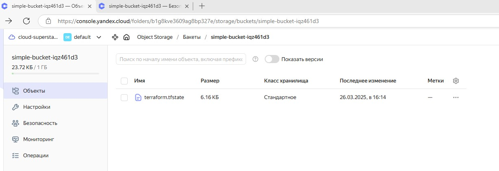
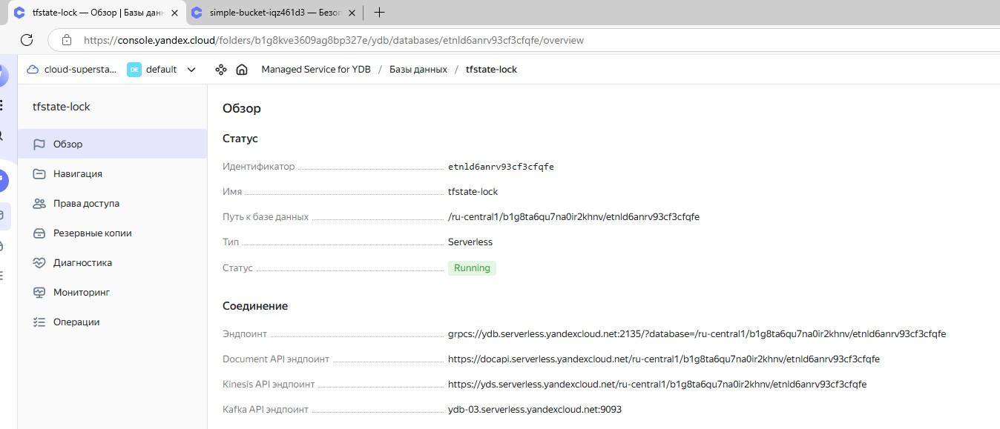
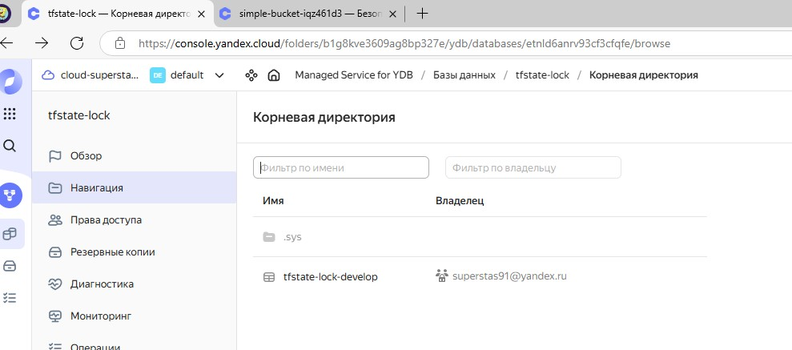
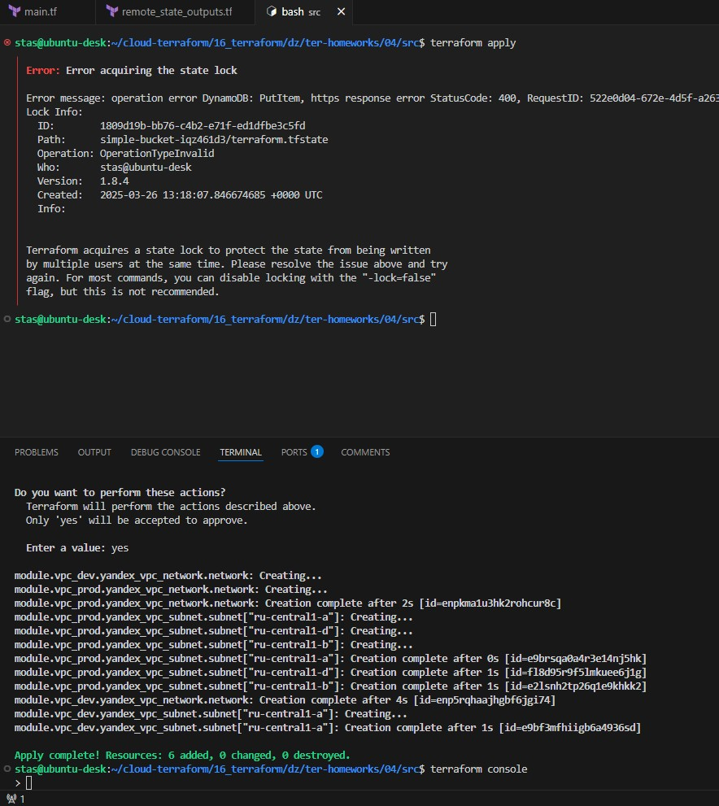
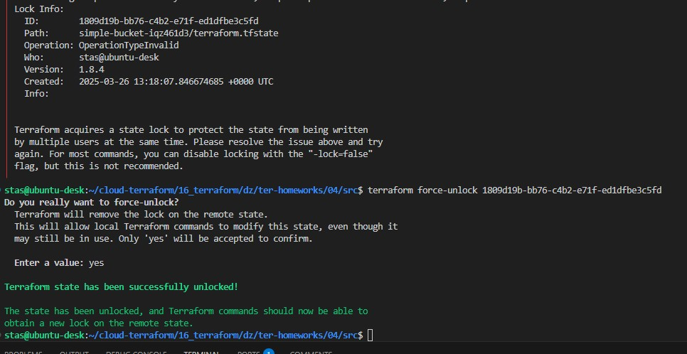
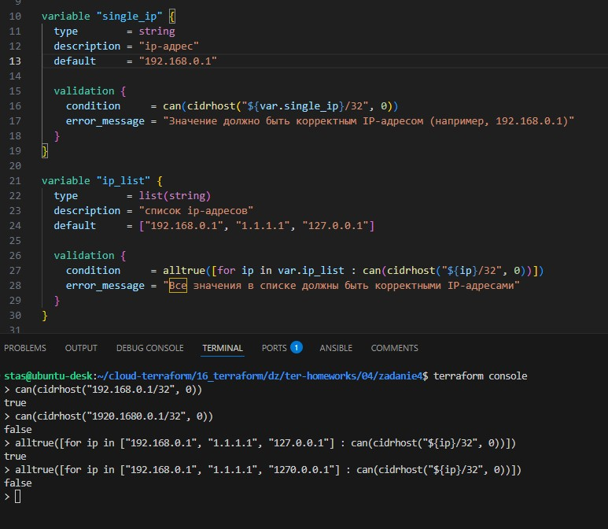
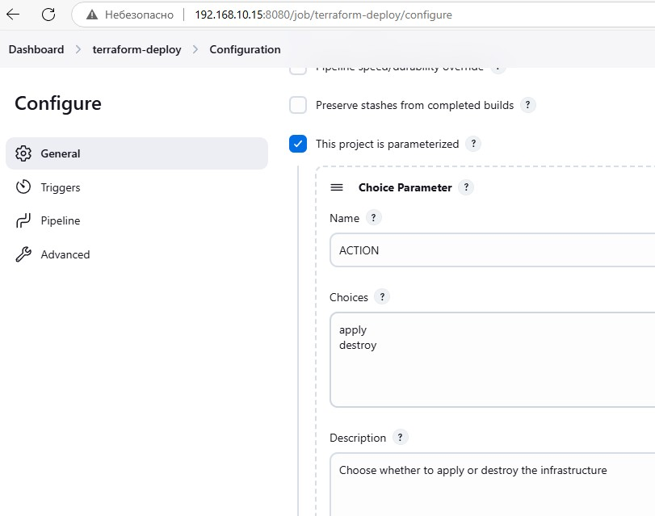
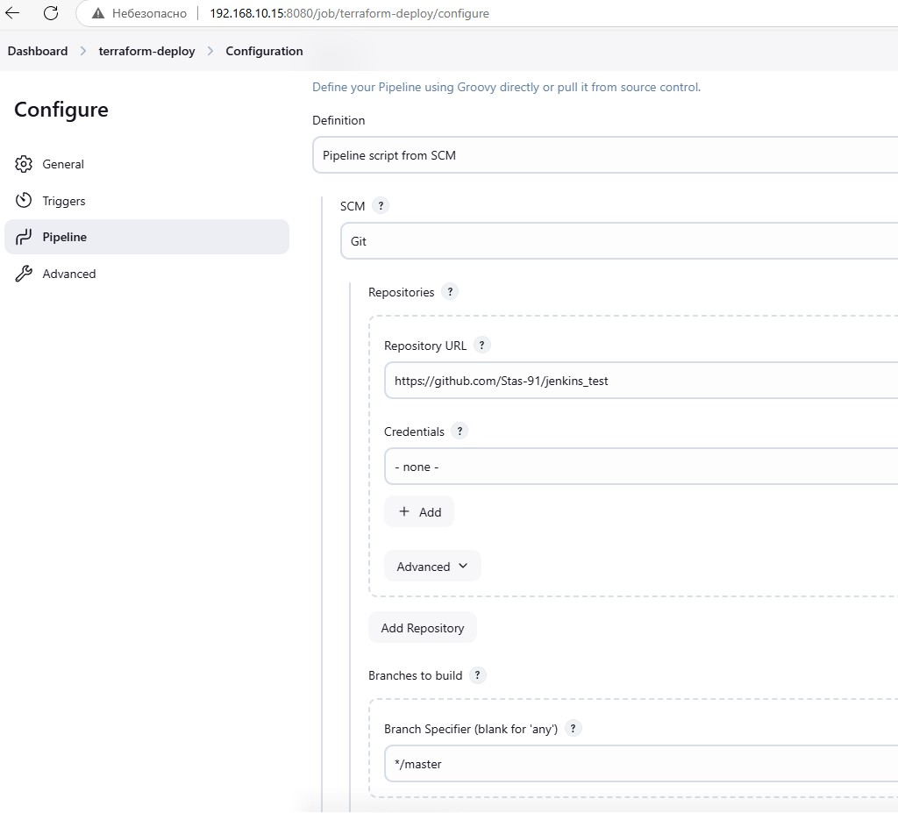
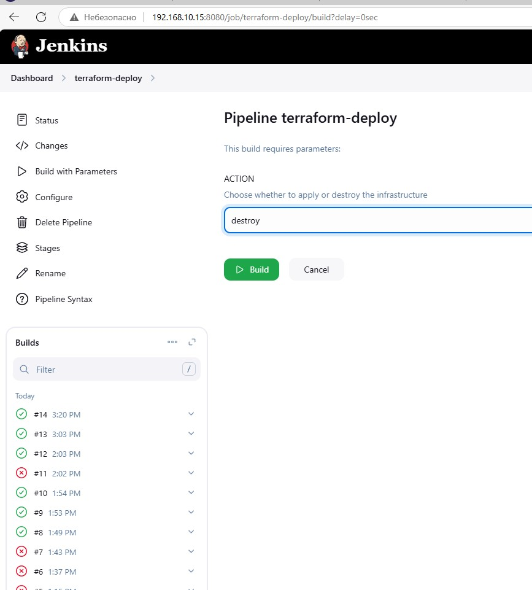

# Домашнее задание к занятию «Использование Terraform в команде» Станислав Помельников

------
### Внимание!! Обязательно предоставляем на проверку получившийся код в виде ссылки на ваш github-репозиторий!
https://github.com/Stas-91/ter-homeworks  
https://github.com/Stas-91/jenkins_test  


Убедитесь что ваша версия **Terraform** ~>1.8.4
Пишем красивый код, хардкод значения не допустимы!


------
### Задание 0
1. Прочтите статью: https://neprivet.com/
2. Пожалуйста, распространите данную идею в своем коллективе.

### Решение 0

В моем коллективе зачастую начинают с вопроса, а потом уже пишут привет :)  

------

### Задание 1

1. Возьмите код:
- из [ДЗ к лекции 4](https://github.com/netology-code/ter-homeworks/tree/main/04/src),
- из [демо к лекции 4](https://github.com/netology-code/ter-homeworks/tree/main/04/demonstration1).
2. Проверьте код с помощью tflint и checkov. Вам не нужно инициализировать этот проект.
3. Перечислите, какие **типы** ошибок обнаружены в проекте (без дублей).

### Решение 1

#### 1.  tflint  
- Missing version constraint for provider "..."
- variable "..." is declared but not used
- uses a default branch as ref (main) (нет тега или коммита)

#### 2. checkov
- Ensure Terraform module sources use a commit hash, Ensure Terraform module sources use a tag with a version number

------

### Задание 2

1. Возьмите ваш GitHub-репозиторий с **выполненным ДЗ 4** в ветке 'terraform-04' и сделайте из него ветку 'terraform-05'.
2. Повторите демонстрацию лекции: настройте YDB, S3 bucket, yandex service account, права доступа и мигрируйте state проекта в S3 с блокировками. Предоставьте скриншоты процесса в качестве ответа.
3. Закоммитьте в ветку 'terraform-05' все изменения.
4. Откройте в проекте terraform console, а в другом окне из этой же директории попробуйте запустить terraform apply.
5. Пришлите ответ об ошибке доступа к state.
6. Принудительно разблокируйте state. Пришлите команду и вывод.

### Решение 2








------
### Задание 3  

1. Сделайте в GitHub из ветки 'terraform-05' новую ветку 'terraform-hotfix'.
2. Проверье код с помощью tflint и checkov, исправьте все предупреждения и ошибки в 'terraform-hotfix', сделайте коммит.
3. Откройте новый pull request 'terraform-hotfix' --> 'terraform-05'. 
4. Вставьте в комментарий PR результат анализа tflint и checkov, план изменений инфраструктуры из вывода команды terraform plan.
5. Пришлите ссылку на PR для ревью. Вливать код в 'terraform-05' не нужно.

### Решение 3

https://github.com/Stas-91/ter-homeworks/pull/1

------
### Задание 4

1. Напишите переменные с валидацией и протестируйте их, заполнив default верными и неверными значениями. Предоставьте скриншоты проверок из terraform console. 

- type=string, description="ip-адрес" — проверка, что значение переменной содержит верный IP-адрес с помощью функций cidrhost() или regex(). Тесты:  "192.168.0.1" и "1920.1680.0.1";
- type=list(string), description="список ip-адресов" — проверка, что все адреса верны. Тесты:  ["192.168.0.1", "1.1.1.1", "127.0.0.1"] и ["192.168.0.1", "1.1.1.1", "1270.0.0.1"].

### Решение 4



------

## Дополнительные задания (со звёздочкой*)

------
### Задание 5*
1. Напишите переменные с валидацией:
- type=string, description="любая строка" — проверка, что строка не содержит символов верхнего регистра;
- type=object — проверка, что одно из значений равно true, а второе false, т. е. не допускается false false и true true:
```
variable "in_the_end_there_can_be_only_one" {
    description="Who is better Connor or Duncan?"
    type = object({
        Dunkan = optional(bool)
        Connor = optional(bool)
    })

    default = {
        Dunkan = true
        Connor = false
    }

    validation {
        error_message = "There can be only one MacLeod"
        condition = <проверка>
    }
}
```

### Решение 5

```
variable "lowercase_string" {
  type        = string
  description = "Any string"
  
  validation {
    condition     = var.lowercase_string == lower(var.lowercase_string)
    error_message = "The string must not contain uppercase characters."
  }
}
```

```
variable "in_the_end_there_can_be_only_one" {
  description = "Who is better Connor or Duncan?"
  type = object({
    Dunkan = optional(bool)
    Connor = optional(bool)
  })

  default = {
    Dunkan = true
    Connor = false
  }

  validation {
    condition     = (var.in_the_end_there_can_be_only_one.Dunkan != var.in_the_end_there_can_be_only_one.Connor)
    error_message = "There can be only one MacLeod"
  }
}
```
<details>
 <summary>Пасхалка</summary>
    


</details>

------
### Задание 6*

1. Настройте любую известную вам CI/CD-систему. Если вы ещё не знакомы с CI/CD-системами, настоятельно рекомендуем вернуться к этому заданию после изучения Jenkins/Teamcity/Gitlab.
2. Скачайте с её помощью ваш репозиторий с кодом и инициализируйте инфраструктуру.
3. Уничтожьте инфраструктуру тем же способом.

### Решение 6





https://github.com/Stas-91/devops-netology/blob/main/img/16-5-6-1_apply.txt  
https://github.com/Stas-91/devops-netology/blob/main/img/16-5-6-1_destroy.txt  


------
### Задание 7*
1. Настройте отдельный terraform root модуль, который будет создавать YDB, s3 bucket для tfstate и сервисный аккаунт с необходимыми правами. 

### Решение 7

https://github.com/Stas-91/ter-homeworks/tree/main/04/src/bootstrap


